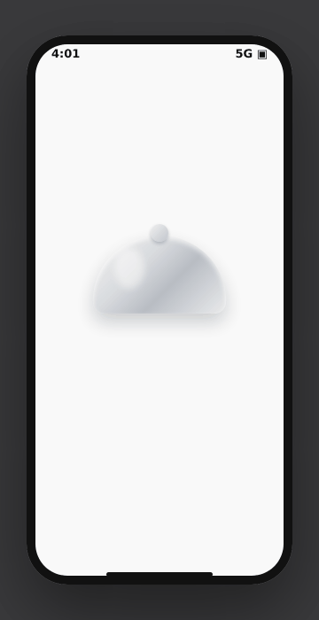

# Snagr Dining — Animated Splash Screen

A self-contained, dependency-free SwiftUI splash screen for **Snagr Dining**.



## The animation ("cloche reveal")

1. A silver **dome (cloche)** sits at center over a hidden app-icon tile.
2. The dome **lifts away and fades** — like a dish being served.
3. As it lifts, the **tile + serif “S”** spring up and a **burst of food**
   (🍣🍔🍜🥗🍤🍩🍕) sprays outward, then clears.
4. **Steam** wisps rise above the tile in a gentle loop — the "hot food" beat.
5. The **“Snagr / DINING”** wordmark fades up.
6. The plate **breathes** (subtle continuous bob) at rest.

> Requires iOS 16+ (`UnevenRoundedRectangle`).

Everything is native SwiftUI — it runs in Xcode Previews, adds **zero** binary
weight, scales crisply at any resolution, and needs no `.json` asset.

## Files

| File | Purpose |
|------|---------|
| `SnagrSplashView.swift` | The splash view + all animation. Drop into your target. |
| `SnagrApp+Example.swift` | Shows how to gate your real UI behind the splash. Reference only. |
| `preview.html` | A browser replica used to generate the GIF below. |
| `splash-preview.gif` | Rendered preview of the animation. |

## Usage

```swift
struct RootView: View {
    @State private var showSplash = true

    var body: some View {
        ZStack {
            HomeView() // your real first screen

            if showSplash {
                SnagrSplashView {
                    withAnimation(.easeInOut(duration: 0.4)) { showSplash = false }
                }
                .transition(.opacity)
                .zIndex(1)
            }
        }
    }
}
```

`onFinished` fires ~2.4s in, after the intro reads — wire it to dismiss the
splash or trigger navigation.

## Tuning

- **Brand color** — the `brand` constant in `SnagrSplashView`.
- **Logo** — swap `Text("S")` for `Image("LogoMark")` to use your exact glyph
  from the screenshot instead of the system serif "S".
- **Timing** — the `runIntro()` timeline (spring response, lift curve, the
  2.7s `onFinished` delay).
- **Food** — the `items` array in `FoodBurst` (swap emojis, change spray
  targets/rotation, add or remove particles).
- **Cloche** — `ClocheView` (dome gradient, size, knob).

## Prefer a designer-authored Lottie file?

The native version above is recommended (no dependency, perfect scaling). If you
later get a `.json` from a designer, swap it in with minimal change:

1. Add the package: `https://github.com/airbnb/lottie-spm` (SPM).
2. Replace the tile/steam stack with:

```swift
import Lottie

LottieView(animation: .named("snagr_food"))
    .playing(loopMode: .playOnce)
    .animationDidFinish { _ in onFinished() }
```

Keep the background, wordmark, and `onFinished` wiring from `SnagrSplashView`.
